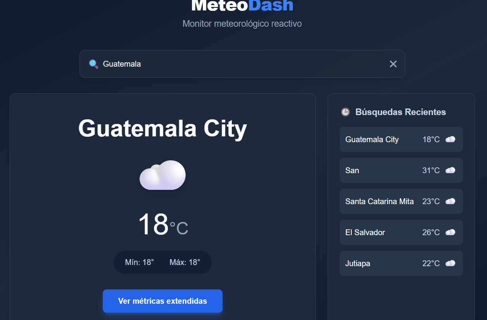
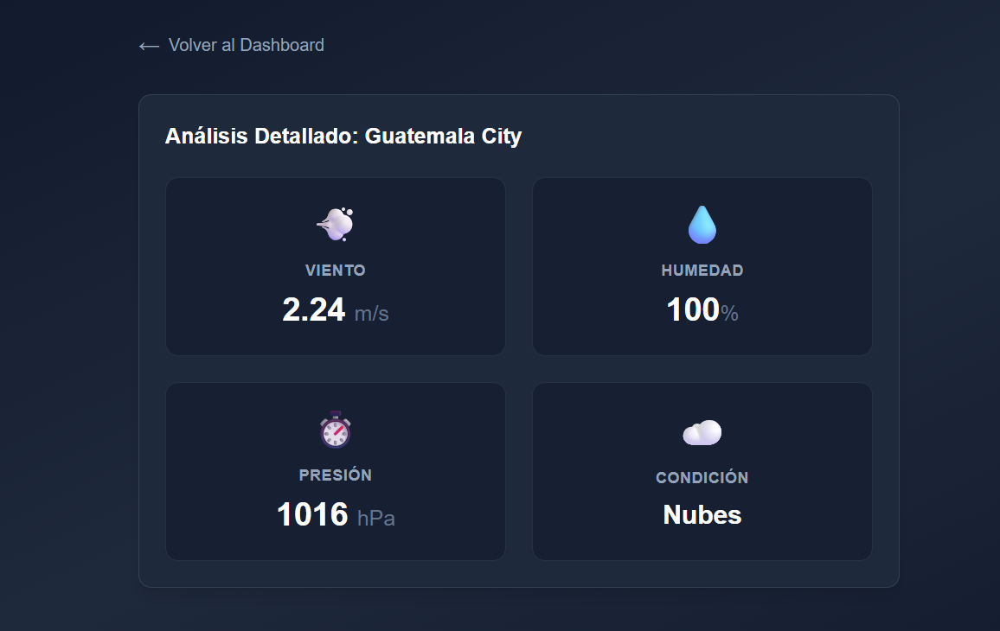

# MeteoDash 🌤️ - Prueba Técnica Frontend

La aplicación está construida con Angular 17, aprovechando herramientas modernas como Signals para el manejo del estado y RxJS para controlar los flujos asíncronos.

## 🚀 Enlaces
- **Live Demo:** [Pega tu link de Vercel aquí]
- **Repositorio:** [Pega tu link de GitHub aquí]

---

## 🎨 Design System y UX

* **Colores:** Decidí implementar un tema oscuro utilizando la paleta `slate` de Tailwind (slate-800 y 900). Un fondo oscuro reduce bastante la fatiga visual si el usuario tiene la pestaña abierta monitoreando el clima un buen rato. Para los llamados a la acción y datos a resaltar, usé un azul (`blue-500`) para darle un aspecto más técnico y limpio.
* **Tipografía:** Elegí **Inter**. Es mi fuente de cabecera para proyectos de datos porque los números y las métricas se leen con mucha mayor claridad que con las fuentes predeterminadas del navegador.
* **Estructura visual:** Organicé la información en tarjetas (cards) con bordes suaves para separar los dominios (clima actual vs historial). La app es 100% responsive: en móviles todo fluye en una sola columna, y en desktop aprovecha el espacio usando un sistema de grillas asimétrico.
* **Manejo de Estados:** Me aseguré de que la app nunca deje al usuario adivinando:
  * *Carga:* Implementé un loader sutil animado para las esperas de red.
  * *Vacío:* Si es la primera visita, hay un mensaje claro invitando a usar el buscador.
  * *Error:* Si el usuario busca una ciudad inexistente, el Interceptor atrapa el error 404 de la API y renderiza una alerta amigable en pantalla, evitando que la aplicación colapse en silencio.

---

## 📸 Capturas de Pantalla

**1. Dashboard Principal (Buscador y Clima Actual)**

**2. Vista de Detalles (Métricas extendidas)**

---

## 🧠 Respuestas a las preguntas técnicas

**¿Qué fue lo que más te interesó de esta prueba técnica?**
Lo que más me gustó fue la libertad arquitectónica. Normalmente las pruebas técnicas son muy cuadradas, pero el requerimiento de manejar actualizaciones en segundo plano y optimizar el buscador me dio el escenario perfecto para salir del típico código espagueti. Fue muy interesante poder implementar las novedades de Angular 17 (Signals y el nuevo Control Flow) y combinarlas con patrones sólidos de RxJS para hacer una app verdaderamente reactiva.

**¿Cuál fue tu mayor reto técnico al desarrollarla y cómo lo resolviste?**
Definitivamente fue coordinar el buscador inteligente a la par del auto-refresco (polling) de 45 segundos. 

El riesgo principal era causar "condiciones de carrera" (que llegaran datos desordenados si el usuario tecleaba rápido) o dejar temporizadores colgados consumiendo memoria. Lo resolví sacando toda la lógica de los componentes y centralizándola en un `WeatherService`.
Para el buscador, usé el módulo reactivo de formularios con `debounceTime` y `distinctUntilChanged` para no bombardear la API en cada tecla. Para el polling, até la emisión de la búsqueda a un `switchMap` con un `timer`. Usar `switchMap` fue la clave: si el usuario está viendo los datos de una ciudad y de pronto busca otra, el operador automáticamente mata el temporizador viejo y la petición HTTP anterior, creando un ciclo limpio para la nueva ciudad. Finalmente, me aseguré de limpiar las suscripciones en el `ngOnDestroy` para evitar memory leaks al cambiar de vista.
